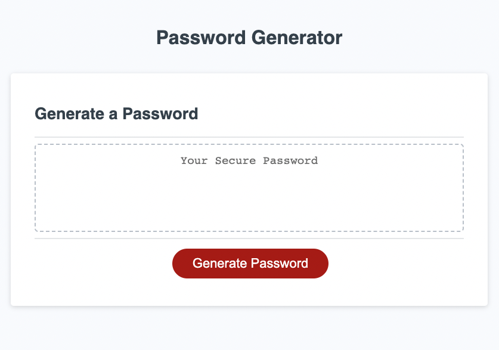

# Module 03 Challenge

## Description

In this assignment we were given HTML and CSS, and had to edit the JavaScript code to allow users to generate their own random password using criteria that they chose.

We were required to ask each user how long the password should be, and if it should use any of the following characters: lowercase letters, uppercase letters, numbers and special characters.

## Mockup

This is a mockup of the appliation we edited.

## Deployed Application

[Click here to view the deployed application.](https://michiewillman.github.io/Module_03_Challenge/)

[Click here to view my code repository.](https://github.com/michiewillman/Module_03_Challenge)
